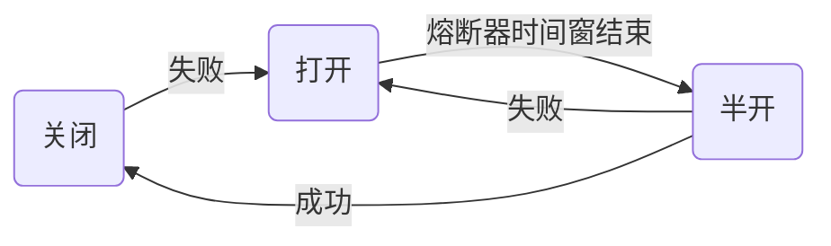

# SpringCloud

## 服务注册

> Eureka

一、搭建eureka server

1. 依赖

```xml
<dependency>
            <groupId>org.springframework.cloud</groupId>
            <artifactId>spring-cloud-starter-netflix-eureka-server</artifactId></dependency>
```

2. 配置

```yaml
eureka:
  instance:
    hostname: localhost
  client:
    register-with-eureka: false #是否将自己注册到服务中心
    fetch-registry: false #是否从eureka中获取注册信息
    service-url:
      defaultZone: http://${eureka.instance.hostname}:${server.port}/eureka/
server:
  port: 9000
```

3. 启动类上添加注解

@EnableEurekaServer

二、将服务提供者注册到eureka

1. 依赖(注意加上版本号)

```xml
<dependency>
            <groupId>org.springframework.cloud</groupId>
            <artifactId>spring-cloud-starter-netflix-eureka-client</artifactId>
  					<version>2.2.1.RELEASE</version>
</dependency>
```

2. 配置

```yaml
eureka:
  client:
    service-url:
      defaultZone: http://localhost:9000/eureka/
  instance:
    prefer-ip-address: true #使用ip地址注册
```

3. 启动类上添加注解(两个均可，不写也可)

@EnableDiscoveryClient

@EnableEurekaClient

三、服务消费者通过注册中心获取服务列表并调用

```Java
@Autowired
private DiscoveryClient discoveryClient;
public void getInstances(){
    List<ServiceInstance> instances = discoveryClient.getInstances("service-product"); //服务名
    ServiceInstance instance = instances.get(0);
		Product product = restTemplate.getForObject("http://"+instance.getHost()+":"+instance.getPort()+"product/1",Product.class);
}
```

四、Eureka的高可用

Server 1

```yaml
spring:
	application:
		name: server
server:
  port: 9000
eureka:
  client:
    service-url:
      defaultZone: http://127.0.0.1:8000/eureka/
```

Server 2

```yaml
spring:
	application:
		name: server
server:
  port: 8000
eureka:
  client:
    service-url:
      defaultZone: http://127.0.0.1:9000/eureka/
```

Client

```yaml
eureka:
  client:
    service-url:
      defaultZone: http://localhost:9000/eureka/,http://localhost:8000/eureka/
  instance:
    prefer-ip-address: true #使用ip地址注册
```

五、细节问题

1. 配置控制台显示ip

```yaml
eureka:
  instance:
    prefer-ip-address: true #使用ip地址注册
    instance-id: ${spring.cloud.client.ip-address}:${server.port} #注册服务id
```

2. 设置服务续约

```yaml
eureka:
  instance:
  	lease-renewal-interval-in-seconds: 5 #注册服务，默认为30
  	lease-expiration-duration-in-seconds: 10 #续约到期时间，默认为90
```

3. 自我保护机制与剔除服务间隔(推荐采用默认配置)

```yaml
eureka:
	server:
		enable-self-preservation: false #关闭自我保护
		eviction-interval-timer-in-ms: 4000 #剔除服务间隔
```

> Consul

一、与Eureka区别

Consul满足CP，而Eureka为AP

二、整合

```xml
<dependency>
            <groupId>org.springframework.cloud</groupId>
            <artifactId>spring-cloud-starter-consul-discovery/artifactId></dependency>
  <dependency>
            <groupId>org.springframework.boot</groupId>
            <artifactId>spring-cloud-starter-actuator</artifactId>
  </dependency>
```

```yaml
spring:
	cloud:
		consul:
			host: 127.0.0.1
			port: 8500
			discovery:
				register: true 
				instance-id: ${spring.application.name} #必须唯一
				service-name: ${spring.application.name}
				port: ${server.port}
				prefer-ip-address: true
				ip-address: ${spring.cloud.client.ip-address}
```

三、其他概念点

agent:	启动一个consul的守护进程

​	dev：开发者模式

​	client： consul代理，和consul server交互，一个微服务对应一个client，微服务和client部署到一台机器上

​	server：真正干活的consul服务，一般3-5个

Gossip协议

Raft协议：保证server集群中数据一致

​	Leader：server集群中唯一处理端请求的

​	Follower：被动接收数据

​	Candidate：候选者

## 服务调用

> Ribbon

一、服务调用

```Java
@LoadBalanced
@Bean
public RestTemplate restTemplate(){
		return new RestTemplate();
}
...
public Product getProduct(){
 		return restTemplate.getForObject("http://service-product/product/1",Product.class); //使用服务名称替换ip地址
}
```

二、负载均衡

Ribbon是一个客户端负载均衡器，会获取服务所有地址，根据内部负载均衡算法获取本次请求的有效地址。

策略修改

```yaml
service-product: #服务名
	ribbon:
		NFLoadBalanceRuleClassName: com.netflix.loadbalancer.RandomRule
	
```

三、重试机制

引入依赖

```xml
<dependency>
            <groupId>org.springframework.retry</groupId>
            <artifactId>spring-retry</artifactId>
</dependency>
```

配置

```yaml
service-product: #服务名
	ribbon:
		ConnectTimeout: 50 
		ReadTimeout: 1000
		OkToRetryOnAllOperations: true #是否对所有操作都进行重试
    MaxAutoRetriesNextServer: 1 #切换实例的重试次数
    MaxAutoRetries: 1 #对当前实例的的重试次数
```

> Feign

一、远程调用

依赖

```xml
<dependency>
            <groupId>org.springframework.cloud</groupId>
            <artifactId>spring-cloud-starter-openfeign</artifactId>
</dependency>
```

定义调用接口

```Java
@FeignClient(name="service-product")
public interface ProductFeignClient{
	@GetMapping(value="/product/{id}")
  public Product findById(@PathVariable("id") Long id);
}
```

启动类上添加

@EnableFeignClients

使用

```Java
@Autowired
private ProductFeignClient feignClient;
@GetMapping("/buy/{id}")
public Product findById(@PathVariable Long id){
  return feignClient.findById(id);
}
```

二、负载均衡

Feign无需配置即可以支持负载均衡，默认为轮询策略，可以通过yml文件配置

三、数据压缩

```yaml
feign:
	compression:
		request:
			enable: true
		response:
			enable: true
```

四、日志配置

```yaml
feign:
	client:
		config:
			service-product: #需要调用的服务名称
				loggerLevel: FULL #NONE，BASIC，HEADERS，FULL
logging:
	level:
		cn.itcast.order.feign.ProductFeignClient: debug
```

## 服务熔断

> Hystrix

一、对RestTemplate的支持

依赖

```xml
<dependency>
            <groupId>org.springframework.cloud</groupId>
            <artifactId>spring-cloud-starter-netflix-hystrix</artifactId>
</dependency>
```

启动类上添加

@EnableCircuitBreaker

添加降级方法

```java
@HystrixCommand(fallbackMethod="orderFallBack")
@GetMapping("/buy/{id}")
public Product getProduct(@PathVariable Long id){
 		return restTemplate.getForObject("http://service-product/product/1",Product.class); //使用服务名称替换ip地址
}
public Product orderFallBack(Long id){ //返回值必须和被保护方法相同
	Product product = new Product();
  product.setMessage("触发降级");
  return product;
}
```

配置

```yml
hystrix:
	command:
		default:
			execution:
				isolation:
					thread:
						timeoutInMilliseconds: 2000 #默认超时时间为1000，即1秒
```

统一降级方法

```java
@DefaultProperties(defaultFallback = "defaultFallBack()") //需要有统一的返回值
public class OrderController{
  	public Product defaultFallBack(){  //不能有参数
			Product product = new Product();
  		product.setMessage("统一降级");
  		return product;
	}
}
```

二、对Feign的支持

Feign中已经集成了Hystrix，无需再引入依赖

开启对hystrix支持

```yaml
feign:
	hystrix:
		enable: true
```

自定义接口的实现类，实现熔断触发的降级逻辑

```java
@FeignClient(name="service-product", fallback = ProductCallBack.class)
public interface ProductFeignClient{
			@GetMapping(value="/product/{id}")
  		public Product findById(@PathVariable("id") Long id);
}

@Component
public class ProductCallBack implements ProductFeignClient{
		public Product findById(Long id){
    		Product product = new Product();
  			product.setMessage("统一降级");
  			return product; 	
    }
}
```

三、通过Actuator获取hystrix的监控数据，dashboard监控数据流

引入依赖

```xml
<dependency>
            <groupId>org.springframework.boot</groupId>
            <artifactId>spring-boot-starter-actuator</artifactId>
</dependency>
<dependency>
            <groupId>org.springframework.cloud</groupId>
            <artifactId>spring-cloud-starter-netflix-hystrix</artifactId>
</dependency>
<dependency>
            <groupId>org.springframework.cloud</groupId>
            <artifactId>spring-cloud-starter-netflix-hystrix-dashboard</artifactId>
</dependency>
```

启动类上添加

@EnableCircuitBreaker

@EnableHystrixDashboard

暴露Actuator监控的所有端点

```yaml
management:
	endpoints:
		web:
			exposure:
				include: '*'
```

访问入口

http://localhost:8781/hystrix

Hystrix Dashboard输入http://localhost:8781/actuator/hystrix.stream

四、turbine聚合所有hystrix

依赖

```xml
<dependency>
            <groupId>org.springframework.cloud</groupId>
            <artifactId>spring-cloud-starter-netflix-turbine</artifactId>
</dependency>
<dependency>
            <groupId>org.springframework.cloud</groupId>
            <artifactId>spring-cloud-starter-netflix-hystrix</artifactId>
</dependency>
<dependency>
            <groupId>org.springframework.cloud</groupId>
            <artifactId>spring-cloud-starter-netflix-hystrix-dashboard</artifactId>
</dependency>
```

配置

```yaml
spring:
	application:
		name: hystrix-turbine
turbine:
	appConfig: service-product #要监控的微服务列表，多个用，分割
	
```

启动类上添加注解

@EnableTurbine

@EnableHystrixDashboard

五、断路器工作状态



配置

```yaml
hystrix:
	command:
		default:
			circuitBreaker:
				requestVolumeThreshold: 20 #触发熔断的最小请求次数，默认20/10秒
				sleepWindowInMilliseconds: 10000 #熔断多少秒后尝试请求，默认5秒
				errorThresholdPercentage: 50 #触发熔断失败请求最小占比，默认50%
```

六、隔离策略

```yaml
hystrix:
	command:
		default:
			execution:
				isolation:
					strategy: ExecutionIsolationStrategy.SEMAPHORE #信号量隔离
					strategy: ExecutionIsolationStrategy.THREAD #线程池隔离
```

> Sentinel

父工程引入

```xml
<dependency>
            <groupId>com.alibaba.cloud</groupId>
            <artifactId>spring-cloud-alibaba-dependencies</artifactId>
  					<version>2.1.0.RELEASE</version>
  					<type>pom</type>
  					<scope>import</scope>
</dependency>
```

子工程引入

```xml
<dependency>
            <groupId>com.alibaba.cloud</groupId>
            <artifactId>spring-cloud-starter-alibaba-sentinel</artifactId>
</dependency>
```

配置

```yaml
spring:
	cloud:
		sentinel:
			transport:
				dashboard: localhost:8080 
```

通用资源保护

```java
@SentinelResourse(blockHandler = "orderBlockHandler", fallback = "orderFallback")
@GetMapping("/buy/{id}")
public Product getProduct(@PathVariable Long id){
 		return restTemplate.getForObject("http://service-product/product/1",Product.class);
}
public Product orderBlockHandler(Long id){
		Product product = new Product();
  	product.setMessage("触发熔断的降级方法");
  	return product;
}
public Product orderFallback(Long id){
		Product product = new Product();
  	product.setMessage("抛出异常的降级方法");
  	return product;
}
```

加载本地配置

```yaml
spring:
	cloud:
		sentinel:
			datasourse:
				dsl:
					file:
						file: classpath:flowrule.json
						data-type: json
						rule-type: flow
			eager: true #默认为懒加载
```

resources下添加flowrule.json

```json
{
  {
  	"resource": "orderFindById",
  	"controlBehavior": 0,
  	"count": 1,
  	"grade": 1,
  	"limitApp": "default",
  	"strategy": 0
	}
}
```

对restTemplate支持

```java
@LoadBalanced
@Bean
@SentinelRestTemplate(fallbackClass=ExceptionUtils.class,fallback="handleBlock")
public RestTemplate restTemplate(){
  	return new RestTemplate();
}

public class ExceptionUtils{
  	//静态方法、固定返回值和参数
		public static SentinelClientHttpResponse handleBlock(HttpRequest request, byte[]body, ClientHttpRequestExecution execution, BlockException ex){
      	System.err.println(ex.getClass().getCanonicalName());
      	return new SentinelClientHttpResponse("限流熔断降级");
    }
}
```

对Feign支持

```yaml
feign:
	sentinel:
		enable: true
```

和hystrix相同

## 微服务网关

> Zuul

一、基础环境搭建

依赖

```xml
<dependency>
            <groupId>org.springframework.cloud</groupId>
            <artifactId>spring-cloud-starter-netflix-zuul</artifactId>
</dependency>
<dependency>
            <groupId>org.springframework.cloud</groupId>
            <artifactId>spring-cloud-starter-netflix-eureka-client</artifactId>
</dependency>
```

启动类开启

@EnableZuulProxy

配置端口和服务名

二、基础路由配置

```yaml
server:
	port: 8080
spring:
	application:
		name: zuul-server
zuul:
	routes:
		product-service:
			path: /product-service/** 
			uri: http://127.0.0.1:9001
```

三、面向服务路由配置

```yaml
server:
	port: 8080
spring:
	application:
		name: zuul-server
zuul:
	routes:
		product-service: #路由id，随便写
			path: /product-service/** 
			serviceId: service-product #转发的微服务的服务名
eureka:
  client:
    service-url:
      defaultZone: http://localhost:9000/eureka/
  instance:
    prefer-ip-address: true
```

四、简化路由配置

规则：如果路由id和serviceId一致，可以简写

```yaml
zuul:
	routes:
		service-product: /product-service/**
```

如果当前服务名为service-product，则默认请求映射路径为/service-product/**

五、过滤器

使用过滤器实现登录验证

```java
@Component
@Slf4j
public class JwtFilter extends ZuulFilter {

    @Autowired
    ObjectMapper mapper;

    private AntPathMatcher matcher = new AntPathMatcher();
    private final String[] path = {
            "/noteApi/user/register/**",
            "/noteApi/user/activate/**",
            "/noteApi/user/login/**"
    };
    @Override
    public String filterType() {
        return FilterConstants.PRE_TYPE;
    }

    @Override
    public int filterOrder() {
        return 1; //越低越优先
    }

    @Override
    public boolean shouldFilter() {
        RequestContext context = RequestContext.getCurrentContext();
        for (String url : path) {
            if (matcher.match(url, context.getRequest().getRequestURI())) {
                return false;
            }
        }
        return true;
    }

    @Override
    public Object run() {
        RequestContext ctx = RequestContext.getCurrentContext();
        HttpServletRequest request = ctx.getRequest();
        String token = request.getHeader("token").substring(5);
        Claims claims;
        try {
            //解析没有异常则表示token验证通过，如有必要可根据自身需求增加验证逻辑
            claims = JwtUtil.parseJwt(token);
            log.info("token : {} 验证通过", token);
            //对请求进行路由
            ctx.setSendZuulResponse(true);
            //请求头加入userId，传给业务服务
            ctx.addZuulRequestHeader("email", claims.getId());
        } catch (ExpiredJwtException expiredJwtEx) {
            log.error("token : {} 过期", token );
            ctx.setSendZuulResponse(false);
            //ctx.setResponseStatusCode(HttpStatus.UNAUTHORIZED.value());
            throw new CommonServiceException(ServiceEnum.INVALID_TOKEN);
        } catch (Exception ex) {
            log.error("token : {} 验证失败" , token );
            ctx.setSendZuulResponse(false);
            throw new CommonServiceException(-1, ex.getMessage());
        }
        return null;
    }

}
```

使用过滤器限流

```java
@Component
public class OrderRateFilter extends ZuulFilter{
  	//每秒1000个令牌
  	private static final RateLimiter RATE_LIMITER = RateLimiter.create(1000);
		@Override
    public String filterType() {
        return FilterConstants.PRE_TYPE;
    }
    @Override
    public int filterOrder() {
        return 1;
    }
    @Override
    public boolean shouldFilter() {
        return true;
    }
    @Override
    public Object run() {
       	RequestContext ctx = RequestContext.getCurrentContext();
        HttpServletRequest request = ctx.getRequest();
        if(!RATE_LIMITER.tryAcquire()){
          	ctx.setSendZuulResponse(false);
          	ctx.setResponseStatusCode(HttpStatus.TOO_MANY_REQUESTS.value());
        }
        return null;
    }
}
```

六、常见问题解析

- 敏感头过滤

Zuul会默认过滤一些敏感头部信息

```java
private Set<String> sensitiveHeaders = new LinkedHashSet<>(Arrays.asList("Cookie","Set-Cookie","Authorization"));
```

解决办法：设为空即可

```yml
zuul:
	sensitive-headers: 
```


> SpringCloudGateway

一、基本配置

依赖

```xml
<!--
	springCloudGateway内部通过netty+webflux实现，与springmvc存在冲突，需要去掉web的依赖
-->
<dependency>
            <groupId>org.springframework.cloud</groupId>
            <artifactId>spring-cloud-starter-gateway</artifactId>
</dependency>
```

不需要额外添加注解

配置

```yaml
spring:
	cloud:
		gateway:
			routes:
			#配置路由：路由id，路由到微服务的uri，断言(判断条件)
			- id: product-service #唯一即可
				uri: http://127.0.0.1:9001 #目标微服务请求地址
				predicates:
				- Path=/product/** #其他路由规则自行查阅
```

二、动态路由配置

引入Eureka依赖

```yaml
server:
	port: 8080
spring:
	application:
		name: gateway-server
spring:
	cloud:
		gateway:
			routes:
			#配置路由：路由id，路由到微服务的uri，断言(判断条件)
			- id: product-service #唯一即可
				uri: lb://service-product #lb://根据微服务名称从注册中心拉取服务请求路径
				predicates:
				- Path=/product/** #其他路由规则自行查阅
eureka:
  client:
    service-url:
      defaultZone: http://localhost:9000/eureka/
  instance:
    prefer-ip-address: true
```

重写转发路径

```yaml
spring:
	cloud:
		gateway:
			routes:
			#配置路由：路由id，路由到微服务的uri，断言(判断条件)
			- id: product-service #唯一即可
				uri: lb://service-product #lb://根据微服务名称从注册中心拉取服务请求路径
				predicates:
				- Path=/product-service/**
        filters: #配置路由过滤器 http://localhost:8080/product-service/product/1 -> http://127.0.0.1:9001/product/1
        - RewritePath=/product-service/(?<segment>.*),/$\{segment} #路径重写，在yml中$应写为$\
```

微服务名称转发

```yaml
spring:
	cloud:
		gateway:
			discovery:
				locator:
					enable: true
					lower-case-service-id: true #http://localhost:8080/serivce-product/product/1
```

三、过滤器

全局过滤器：模拟认证过滤

```java
@Component
public class LoginFilter implements GlobalFilter, Ordered{
		@Override
  	public Mono<Void>filter(ServerWebExchange exchange, GatewayFilterChain chain){
    		String token = exchange.getRequest().getQueryParams().getFirst("token");
      	if(token == null){
          	exchange.getResponse().setStatusCode(HttpStatus.UNAUTHORIZED);
          	return exchange.getResponse().setComplete();
        }
      	return chain.filter(exchange) //继续执行
    }
  	@Override
  	public int getOrder(){
      	return 0; //越小优先级越高
    }
}
```

### 链路追踪Sleuth

```xml
<dependency>
  	<groupId>org.springframework.cloud</groupId>
  	<artifactId>spring-cloud-starter-sleuth</artifactId>
</dependency>
```

## SpringCloudStream

```xml
<dependency>
            <groupId>org.springframework.cloud</groupId>
            <artifactId>spring-cloud-stream</artifactId>
</dependency>
<dependency>
            <groupId>org.springframework.cloud</groupId>
            <artifactId>spring-cloud-starter-stream-rabbit</artifactId>
</dependency>
<dependency>
            <groupId>org.springframework.cloud</groupId>
            <artifactId>spring-cloud-stream-binder-rabbit</artifactId>
</dependency>
```

生产者

```yaml
spring:
	rabbitmq:
		addresses: 127.0.0.1
		username:	guest
		password: guest
	cloud:
		stream:
			bindings:
				output:
					destination: itcast-default 
			binders:
				defaultRabbit:
					type: rabbit
```


```java
@Component
@EnableBinding(Source.class)
public class MessageSender{
		@Autowired
  	private MessageChannel output;
  	public void send(Object obj){
    		output.send(MessageBuilder.withPayload(obj).build());
    }
}
```

消费者

```yaml
spring:
	rabbitmq:
		addresses: 127.0.0.1
		username:	guest
		password: guest
	cloud:
		stream:
			bindings:
				input:
					destination: itcast-default 
			binders:
				defaultRabbit:
					type: rabbit
```


```java
@Component
@EnableBinding(Sink.class)
public class MessageListener{
		@StreamListener(Sink.INPUT)
		public void input(String message){
    }
}
```

分组

```yaml
spring:
	rabbitmq:
		addresses: 127.0.0.1
		username:	guest
		password: guest
	cloud:
		stream:
			bindings:
				input:
					destination: itcast-default 
					group: group1 #同名组的多个消费者，只有一个消费消息
			binders:
				defaultRabbit:
					type: rabbit
```

分区

生产者

```yaml
spring:
	rabbitmq:
		addresses: 127.0.0.1
		username:	guest
		password: guest
	cloud:
		stream:
			bindings:
				output:
					destination: itcast-default
          producer:
          	partition-key-expression: payload
          	partition-count: 2
			binders:
				defaultRabbit:
					type: rabbit
```

消费者

```yaml
spring:
	rabbitmq:
		addresses: 127.0.0.1
		username:	guest
		password: guest
	cloud:
		stream:
			instanceCount: 2 #消费者总数
			instanceIndex: 0 #当前消费者索引
			bindings:
				input:
					destination: itcast-default
					consumer:
						partitioned: true
			binders:
				defaultRabbit:
					type: rabbit
```

## 	配置中心

> SpringCloudConfig

一、config-server模块

```xml
<dependency>
            <groupId>org.springframework.cloud</groupId>
            <artifactId>spring-cloud-config-server</artifactId>
</dependency>
```

启动类上添加

@EnableConfigServer

配置

```yaml
spring:
	cloud:
		config:
			server:
				git:
					uri: https://gitee.com/onion/config.git
```

二、其他模块

```xml
<dependency>
            <groupId>org.springframework.cloud</groupId>
            <artifactId>spring-cloud-starter-config</artifactId>
</dependency>
```

新建bootstrap.yml中添加

```yaml
spring:
	clouds:
		config:
			name: product #应用名称
			profile: dev #开发环境 对应product-dev.yml
			label: master
			uri: http://localhost:10000 #config-server的请求地址				
```

三、动态刷新

依赖

```xml
<dependency>
            <groupId>org.springframework.cloud</groupId>
            <artifactId>spring-cloud-starter-actuator</artifactId>
</dependency>
```

需要动态刷新数据的类上添加

@RefreshScope

配置

```yaml
management:
	endpoints:
		web:
			exposure:
				include: refresh
```

发送post请求

```http
http://localhost:9002/actuator/refresh
```

四、高可用

注册到Eureka中

```yaml
spring:
	clouds:
		config:
			name: product #应用名称
			profile: dev #开发环境 对应product-dev.yml
			label: master
			discovery:
				enable: true
				service-id: config-server
```

五、消息总线bus

Config-server

```xml
<dependency>
            <groupId>org.springframework.cloud</groupId>
            <artifactId>spring-cloud-bus</artifactId>
</dependency>
<dependency>
            <groupId>org.springframework.cloud</groupId>
            <artifactId>spring-cloud-stream-binder-rabbit</artifactId>
</dependency>
```


```yml
#配置rabbit mq
management:
	endpoints:
		web:
			exposure:
				include: bus-refresh
```

> Apollo


