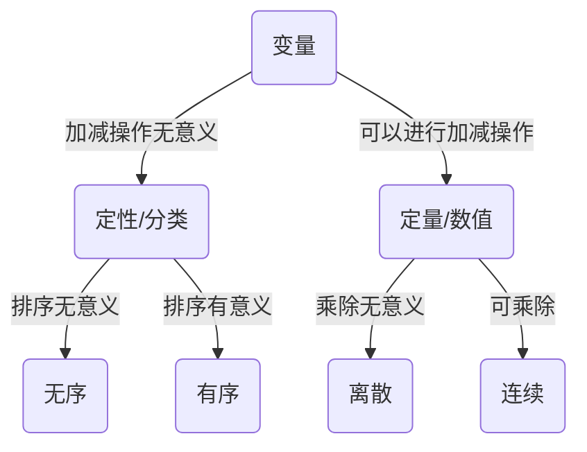

数学基础 7星级精品重点打造

> 高等数学

- 空间解析几何

1. 方向角与方向余弦

$\vec{a}$与$x,y,z$轴正方向夹角，记为$\alpha,\beta,\gamma$

$\vec{a}=(a_1,b_1,c_1)$

$cos\alpha=\frac{a_1}{|\vec{a}|}=\frac{a_1}{\sqrt{a_1^2+b_1^2+c_1^2}}$

$cos\beta=\frac{b_1}{|\vec{a}|}=\frac{b_1}{\sqrt{a_1^2+b_1^2+c_1^2}}$

$cos\gamma=\frac{c_1}{|\vec{a}|}=\frac{c_1}{\sqrt{a_1^2+b_1^2+c_1^2}}$

$cos^2\alpha+cos^2\beta+cos^2\gamma=1$

2. 向量的数量积

$\vec{a}·\vec{b}=\begin{cases}|\vec{a}||\vec{b}|cos(\vec{a},\vec{b}) \\a_1a_2+b_1b_2+c_1c_2\end{cases}$

利用其证明柯西不等式(所有的数均为实数)

$(a_1a_2+b_1b_2+c_1c_2)^2\le(a_1^2+b_1^2+c_1^2)(a_2^2+b_2^2+c_2^2)$

简证：

$\vec{a}\vec{b}=|\vec{a}||\vec{b}|cos(\vec{a},\vec{b})$

$|\vec{a}\vec{b}|=|\vec{a}||\vec{b}||cos(\vec{a},\vec{b})|\le|\vec{a}||\vec{b}|$

3. 向量的向量积

$\vec{a}\times\vec{b}$

方向：右手准则

大小：$|\vec{a}\times\vec{b}|=|\vec{a}||\vec{b}|sin(\vec{a},\vec{b})$

性质：

$a//b\leftrightarrow \vec{a}\times \vec{b}$

$\vec{a}\times\vec{b}\perp \vec{a},\vec{a}\times\vec{b}\perp \vec{b}$

$\vec{a}\times\vec{b}=-\vec{b}\times\vec{a}$

$\vec{i}\times\vec{j}=\vec{k},\vec{j}\times\vec{k}=\vec{i},\vec{k}\times\vec{i}=\vec{j}$

代数公式：

$\vec{a}\times\vec{b}=\{b_1c_2-b_2c_1,c_1a_2-c_2a_1,a_1b_2-a_2b_1\}$

几何应用：

$|\vec{a}\times\vec{b}|=2S_{\Delta}$

4. 平面

平面的点法式方程：$A(x-x_0)+B(y-y_0)+C(z-z_0)=0$

$M_0(x_0,y_0,z_0)$为平面内一点，法向量为$(A,B,C)$

平面的截距式方程：$\frac{x}{a}+\frac{y}{b}+\frac{z}{c}=1$

平面的一般式方程：$Ax+By+Cz+D=0$

法向量为$(A,B,C)$

平面的夹角：

$\pi_1:A_1x+B_1y+C_1z+D_1=0 \\ \pi_2:A_2x+B_2y+C_2y+D_2=0$

$\vec{n_1}=(A_1,B_1,C_1),\vec{n_2}=(A_2,B_2,C_2)$

$cos\theta=|\frac{\vec{n_1}·\vec{n_2}}{|\vec{n_1}|·|\vec{n_2}|}|$

5. 空间直线

直线的点向式(对称式)方程：$\frac{x-x_0}{m}=\frac{y-y_0}{n}=\frac{z-z_0}{p}$

其中，直线的方向向量为$(m,n,p)$

直线的参数式方程：$\begin{cases}x=x_0+mt \\ y=y_0+nt \\ z=z_0+pt\end{cases}$

直线的一般式方程：$\begin{cases}A_1x+B_1y+C_1z+D_1=0 \\ A_2x+B_2y+C_2z+D_2=0\end{cases}$

$\vec{n_1}=(A_1,B_1,C_1),\vec{n_2}=(A_2,B_2,C_2)$

$\vec{n_1}\times\vec{v_2}$

6. 点到平面距离

$\pi:Ax+By+Cz+D=0$

$M:(x_0,y_0,z_0)$

$d=\frac{|Ax_0+By_0+Cz_0+D|}{\sqrt{A^2+B^2+C^2}}$

7. 平面束

$L=\begin{cases}A_1x+B_1y+C_1z+D_1=0 \\ A_2x+B_2y+C_2z+D_2=0\end{cases}$

过L的平面束为$A_1x+B_1y+C_1z+D_1+\lambda(A_2x+B_2y+C_2z+D_2)=0$

例：$\begin{cases}x+y-z-1=0 \\ x-y+z+1=0\end{cases}$在平面$x+y+z=0$上的投影直线

解：设过L的平面束为$(\lambda+1)x+(1-\lambda)y+(\lambda-1)z+\lambda-1=0$

则有$(\lambda+1,1-\lambda,\lambda-1)·(1,1,1)=0 \rightarrow \lambda=-1$

故投影直线为$\begin{cases}y-z-1=0 \\ x+y+z=0\end{cases}$

8. 曲面

柱面：$F(x,y)=0$为母线平行为$z$轴的柱面

投影曲线：$\begin{cases}F(x,y)=0 \\ z=0\end{cases}$

旋转曲面：

$L:\begin{cases}f(x,y)=0 \\ z=0\end{cases}$绕$x$轴旋转而成的曲面为$f(x,\pm\sqrt{y^2+z^2})=0$

9. 空间曲线

一般式：$L:\begin{cases}F(x,y,z)=0 \\ G(x,y,z)=0\end{cases}$

参数式：$L:\begin{cases}x=R\cos wt \\ y=R\sin wt \\ z=v_0t\end{cases}$

投影曲线：

求$L:\begin{cases}F(x,y,z)=0 \\ G(x,y,z)=0\end{cases}$在$xOy$平面内投影曲线$L_0$，即消去$z$，得到$H(x,y)=0$，则$L_0:\begin{cases}H(x,y)=0 \\ z=0\end{cases}$

- 无穷级数

1. 数项级数的判敛

$\sum_{n=1}^{\infty}u_n=u_1+u_2+\cdots+u_n+\cdots$

$Sn=u_1+u_2+\cdots+u_n$

$\sum_{n=1}^{\infty}u_n$收敛$\Leftrightarrow \lim_{n\to\infty}S_n$存在

$\sum_{n=1}^{\infty}u_n$收敛$\Rightarrow \lim_{n\to\infty}u_n=0$

$\sum_{n=1}^{\infty}u_{n+1}-u_n$收敛$\Leftrightarrow \lim_{n\to\infty}u_n$存在

> 线性代数

> 概率论

> 数理统计

- 统计基础

| 尺度 | 举例             | 逻辑与运算        | 类别              | 属性                   |
| ---- | ---------------- | ----------------- | ----------------- | ---------------------- |
| 名目 | 性别、颜色       | $=$ $\ne$         | 定性/无序分类变量 | 数字有意义             |
| 次序 | 教育程度、评价   | $=$ $\ne$ > <     | 定性/有序分类变量 | 有从大到小顺序         |
| 等距 | 温度、年份、时间 | $=$ $\ne$ > < + - | 定量/数值变量     | 任意位置单位间距相同   |
| 等比 | 身高、体重、年龄 | $=$ $\ne$ > < + - | 定量/数值变量     | 零表示被测量属性不存在 |

没有真零点，则乘除运算结果不唯一，如摄氏度与华氏度。

> 凸优化