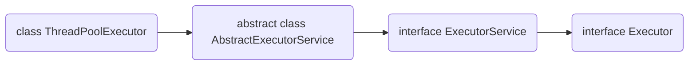

## ThreadLocal

### 使用场景举例

```java
public class ThreadLocalNormalUsage {
    public static ExecutorService threadPool = Executors.newFixedThreadPool(10);
    public static void main(String[] args) {
        for (int i = 0; i < 30; i++) {
            int finalI = i;
            threadPool.submit(new Runnable() {
                @Override
                public void run() {
                    String date = new ThreadLocalNormalUsage0().date(finalI);
                    System.out.println(date);
                }
            });
        }
        threadPool.shutdown();
    }
    public String date(int seconds) {
        Date date = new Date(1000 * seconds);
        SimpleDateFormat dateFormat = ThreadSafeFormatter.dateFormatThreadLocal.get();
        return dateFormat.format(date);
    }
}
class ThreadSafeFormatter {
    public static ThreadLocal<SimpleDateFormat> dateFormatThreadLocal = ThreadLocal.withInitial(() -> new SimpleDateFormat("yyyy-MM-dd hh:mm:ss"));
}
```


```java
public class ThreadLocalNormalUsage4 {
    public static void main(String[] args) {
        new Service1().process();
    }
}
class User {
    String name;
    public User(String name) {
        this.name = name;
    }
}
class UserContextHolder {
    public static ThreadLocal<User> holder = new ThreadLocal<>();
}
class Service1 {
    public void process() {
        User user = new User("Onion");
        UserContextHolder.holder.set(user);
        new Service2().process();
    }
}
class Service2 {
    public void process() {
        User user = UserContextHolder.holder.get();
        System.out.println(user.name);
        new Service3().process();
    }
}
class Service3 {
    public void process() {
        User user = UserContextHolder.holder.get();
        System.out.println(user.name + " is handsome");
      	UserContextHolder.holder.remove();
    }
}

```

###作用

让某个需要用到的对象在线程间隔离，每个线程都有自己独立的对象

在任何方法中都可以轻松获取到该对象

### 好处

线程安全

不需要加锁

高效利用内存

避免传参的繁琐

### 重要方法

```java
T initialValue()
void set(T v)
T get()
void remove()
```

### 内存泄露

ThreadLocalMap的每一个Entry都是一个对key的弱饮用，每个Entry包含了一个对value的强引用。

正常情况下，线程终止，保存在ThreadLocal里的value会被垃圾回收。

如果线程不终止，比如线程需要保持很久，如下调用链，value始终无法被回收。

Thread$\rightarrow$ThreadLocalMap$\rightarrow$Entry(key为null)$\rightarrow$Value

调用set，remove，rehash方法会扫描key为null的Entry，并把对应的value设置为null。

阿里规约：使用完ThreadLocal后调用remove对象。

## 线程池

### Executor家族



```java
public interface Executor {
    void execute(Runnable command);
}

public interface ExecutorService extends Executor {
    void shutdown();
  
    List<Runnable> shutdownNow();
  
    boolean isShutdown();
  
    boolean isTerminated();
  
    boolean awaitTermination(long timeout, TimeUnit unit)
        throws InterruptedException;
  
    <T> Future<T> submit(Callable<T> task);
  
    <T> Future<T> submit(Runnable task, T result);
 
    Future<?> submit(Runnable task);
  
    <T> List<Future<T>> invokeAll(Collection<? extends Callable<T>> tasks)
        throws InterruptedException;
  
    <T> List<Future<T>> invokeAll(Collection<? extends Callable<T>> tasks,
                                  long timeout, TimeUnit unit)
        throws InterruptedException;
  
    <T> T invokeAny(Collection<? extends Callable<T>> tasks)
        throws InterruptedException, ExecutionException;
  
    <T> T invokeAny(Collection<? extends Callable<T>> tasks,
                    long timeout, TimeUnit unit)
        throws InterruptedException, ExecutionException, TimeoutException;
}
//Executors为工具类，列举部分方法
public class Executors {

    public static ExecutorService newFixedThreadPool(int nThreads) {
        return new ThreadPoolExecutor(nThreads, nThreads,
                                      0L, TimeUnit.MILLISECONDS,
                                      new LinkedBlockingQueue<Runnable>());
    }
  
   	public static ExecutorService newCachedThreadPool() {
        return new ThreadPoolExecutor(0, Integer.MAX_VALUE,
                                      60L, TimeUnit.SECONDS,
                                      new SynchronousQueue<Runnable>());
    }
  
    public static ScheduledExecutorService newScheduledThreadPool(int corePoolSize) {
        return new ScheduledThreadPoolExecutor(corePoolSize);
    }

    public static ExecutorService newWorkStealingPool(int parallelism) {
        return new ForkJoinPool
            (parallelism,
             ForkJoinPool.defaultForkJoinWorkerThreadFactory,
             null, true);
    }

    public static ExecutorService newWorkStealingPool() {
        return new ForkJoinPool
            (Runtime.getRuntime().availableProcessors(),
             ForkJoinPool.defaultForkJoinWorkerThreadFactory,
             null, true);
    }
}
```

### 构造方法

```java
public ThreadPoolExecutor(int corePoolSize,
                              int maximumPoolSize,
                              long keepAliveTime,
                              TimeUnit unit,
                              BlockingQueue<Runnable> workQueue,
                              ThreadFactory threadFactory,
                              RejectedExecutionHandler handler)
  //corePoolSize 核心线程数
  /*
  1.线程数小于corePoolSize，即使其他工作线程处于空闲状态也会创建新线程来运行任务
  2.线程数大于等于corePoolSize小于maximumPoolSize，将任务放进队列
  3.队列已满，线程数小于maximumPoolSize，创建新线程来运行任务
  4.队列已满，线程数大于等于maximumPoolSize，拒绝该任务
  */
  
  //maximumPoolSize 
  /*
  1.设置corePoolSize和maximumPoolSize相同，可以创建固定大小的线程池
  2.设置maximumPoolSize为Integer.MAX_VALUE，可以允许线程池容纳任意数量的并发任务
  3.如果使用无界队列LinkedBlockingQueue，线程数不会超过corePoolSize
  4.线程池希望保持较少的线程数，并且只有在负载很大时才增加它
  */
  
  //keepAliveTime
  /*
  当前线程数多于corePoolSize，如果多余的线程空闲时间超过keepAliveTime会被终止
  */
  
  //workQueue
  /*
  SynchronousQueue：直接交接，无容量
  LinkedBlockingQueue：无界队列
  ArrayBlockingQueue：有界队列
  */
  
  //threadFactory 线程工厂
  /*
  默认使用Executors.defaultThreadFactory()，创建出的线程都在同一个线程组，拥有同样的NORM_PRIORITY优先级并且都不是守护线程，可以自行制定
  */
  
  //handler 拒绝处理器
```

### 演示使用

```java
//newFixedThreadPool使用
public class ThreadPool1 {
    public static void main(String[] args) {
        ExecutorService executorService = Executors.newFixedThreadPool(4);
        for (int i = 0; i < 1000; i++) {
            executorService.execute(new Task());
        }
    }
}
class Task implements Runnable {
    @Override
    public void run() {
        try {
            Thread.sleep(500);
        } catch (InterruptedException e) {
            e.printStackTrace();
        }
        System.out.println(Thread.currentThread().getName());
    }
}
```

```java
//内存溢出
public class ThreadPool {
    public static void main(String[] args) {
        ExecutorService executorService = Executors.newFixedThreadPool(1);
        for (int i = 0; i < Integer.MAX_VALUE; i++) {
            executorService.execute(new Task());
        }
    }
}
class Task implements Runnable {
    @Override
    public void run() {
        try {
            Thread.sleep(100000000);
        } catch (InterruptedException e) {
            e.printStackTrace();
        }
    }
}
```

```java
//定时，周期任务
public class ThreadPool {
    Executors executors;
    public static void main(String[] args) {
        ScheduledExecutorService executorService = Executors.newScheduledThreadPool(10);
        Executors.newScheduledThreadPool(5);
        executorService.schedule(new Task(),5, TimeUnit.SECONDS);
        executorService.scheduleAtFixedRate(new Task(), 1, 3, TimeUnit.SECONDS);
    }
}
class Task implements Runnable {
    @Override
    public void run() {
        try {
            Thread.sleep(500);
        } catch (InterruptedException e) {
            e.printStackTrace();
        }
        System.out.println(Thread.currentThread().getName());
    }
}
```

### 线程池线程数量设定经验

CPU密集型（加密，计算hash等）：最佳线程数为CPU核心数1-2倍

耗时IO型（读写数据库、文件、网络读写等）：最佳线程数可以大于CPU核心数若干倍，参考Brain Goetz的计算方法：

线程数=CPU核心数*（1+平均等待时间/平均工作时间）

### 常见线程池总结

| 参数          | Fixed                | Cached            | Scheduled         | Single |
| ------------- | -------------------- | ----------------- | ----------------- | ------ |
| corePoolSize  | constructor-arg      | 0                 | constructor-arg   | 1      |
| maxPoolSize   | same as corePoolSize | Integer.MAX_VALUE | Integer.MAX_VALUE | 1      |
| keepAliveTime | 0                    | 60 seconds        | 0                 | 0      |
| workQueue     | Linked               | Synchronous       | DelayedWork       | Linked |

### 停止线程池

```java
void shutdown(); //现存任务继续执行，后续任务拒绝。后续调用execute()会抛出RejectedExecutionException
boolean isShutdown(); //执行shutdown()后会返回true
boolean isTerminated(); //执行完毕返回true
boolean awaitTermination(long timeout, TimeUnit unit) throws InterruptedException;
/*
1.在规定时间内执行完毕（非关闭），返回true
2.在规定时间未执行完毕，返回false
3.在规定时间内被中断，抛出InterruptedException
*/
List<Runnable> shutdownNow(); //立刻关闭线程池，返回正在等待的线程
```

```java
public class ThreadPool1 {
    public static void main(String[] args) throws InterruptedException {
        ExecutorService executorService = Executors.newFixedThreadPool(10);
        for (int i = 0; i < 100; i++) {
            executorService.execute(new Task());
        }
        Thread.sleep(1500);
        executorService.shutdownNow();
    }
}
class Task implements Runnable {
    @Override
    public void run() {
        try {
            Thread.sleep(500);
            System.out.println(Thread.currentThread().getName());
        } catch (InterruptedException e) {
            System.out.println(Thread.currentThread().getName() + "被中断");
        }
    }
}
```

### 拒绝任务

时机

- Executor关闭后，提交新任务会被拒绝
- Executor对最大线程和工作队列容量使用有限边界并已经达到饱和

拒绝策略

- AbortPolicy
- DiscardPolicy
- DiscardOldestPolicy
- CallerRunsPolicy

### 钩子函数

```java
public class Pauseable extends ThreadPoolExecutor {
    private boolean isPaused;

    private final ReentrantLock lock = new ReentrantLock();

    private Condition unpaused = lock.newCondition();

    public Pauseable(int corePoolSize, int maximumPoolSize, long keepAliveTime, TimeUnit unit, BlockingQueue<Runnable> workQueue) {
        super(corePoolSize, maximumPoolSize, keepAliveTime, unit, workQueue);
    }
    public Pauseable(int corePoolSize, int maximumPoolSize, long keepAliveTime, TimeUnit unit, BlockingQueue<Runnable> workQueue, ThreadFactory threadFactory) {
        super(corePoolSize, maximumPoolSize, keepAliveTime, unit, workQueue, threadFactory);
    }
    public Pauseable(int corePoolSize, int maximumPoolSize, long keepAliveTime, TimeUnit unit, BlockingQueue<Runnable> workQueue, RejectedExecutionHandler handler) {
        super(corePoolSize, maximumPoolSize, keepAliveTime, unit, workQueue, handler);
    }
    public Pauseable(int corePoolSize, int maximumPoolSize, long keepAliveTime, TimeUnit unit, BlockingQueue<Runnable> workQueue, ThreadFactory threadFactory, RejectedExecutionHandler handler) {
        super(corePoolSize, maximumPoolSize, keepAliveTime, unit, workQueue, threadFactory, handler);
    }

    @Override
    protected void beforeExecute(Thread t, Runnable r) {
        super.beforeExecute(t, r);
        lock.lock();
        try {
            while (isPaused) {
                unpaused.await();
            }
        } catch (InterruptedException e) {
            e.printStackTrace();
        } finally {
            lock.unlock();
        }
    }

    public void pause() {
        lock.lock();
        try {
            isPaused = true;
        } finally {
            lock.unlock();
        }
    }

    public void resume() {
        lock.lock();
        try {
            isPaused = false;
            unpaused.signalAll();
        } finally {
            lock.unlock();
        }
    }

    public static void main(String[] args) throws InterruptedException {
        Pauseable pauseable = new Pauseable(5, 10, 10L, TimeUnit.SECONDS, new LinkedBlockingQueue<>());
        Runnable runnable = () -> {
            System.out.println("我被执行");
            try {
                Thread.sleep(10);
            } catch (InterruptedException e) {
                e.printStackTrace();
            }
        };
        for (int i = 0; i < 1000; i++) {
            pauseable.execute(runnable);
        }
        Thread.sleep(1500);
        pauseable.pause();
        System.out.println("线程池被暂停");
        Thread.sleep(1500);
        pauseable.resume();
        System.out.println("线程池被恢复");
    }
}

```

### 线程池状态

- RUNNING：接受新任务并处理排队任务
- SHUTDOWN：不接受新任务，处理排队任务
- STOP：不接受新任务，不处理排队任务，中断正在进行的任务
- TIDYING：所有任务终止，workCOunt为0，将运行terminate()钩子方法
- TERMINATED：terminate()运行完成

## 锁

### Lock接口

```java
// lock()不会在异常时释放锁，一定要在finally中释放锁;lock()不能被中断，一旦陷入死锁会永久等待
public class MustUnlock {
    private static Lock lock = new ReentrantLock();
    public static void main(String[] args) {
        lock.lock();
        try {
            System.out.println(Thread.currentThread().getName() + "开始执行任务");
        } finally {
            lock.unlock();
        }
    }
}
//tryLock()在等锁过程中可以被中断
public class TryLockDeadlock implements Runnable {
    int flag = 1;
    static Lock lock1 = new ReentrantLock();
    static Lock lock2 = new ReentrantLock();
    @Override
    public void run() {
        for (int i = 0; i < 100; i++) {
            if (flag == 1) {
                try {
                    if (lock1.tryLock(800, TimeUnit.MILLISECONDS)) {
                        try {
                            System.out.println("线程1获取到了锁1");
                            Thread.sleep(new Random().nextInt(1000));
                            if (lock2.tryLock(800, TimeUnit.MILLISECONDS)) {
                                try {
                                    System.out.println("线程1获取到了锁2");
                                    System.out.println("线程1获取到2把锁");
                                    break;
                                } finally {
                                    lock2.unlock();
                                }
                            }else {
                                System.out.println("线程1获取锁2失败，已重试");
                            }
                        }finally {
                            lock1.unlock();
                            Thread.sleep(new Random().nextInt(1000));
                        }
                    }else {
                        System.out.println("线程1获取锁1失败，已重试");
                    }
                }catch (InterruptedException e) {
                    e.printStackTrace();
                }
            }if (flag == 2) {
                try {
                    if (lock2.tryLock(800, TimeUnit.MILLISECONDS)) {
                        try {
                            System.out.println("线程2获取到了锁2");
                            Thread.sleep(new Random().nextInt(1000));
                            if (lock1.tryLock(800, TimeUnit.MILLISECONDS)) {
                                try {
                                    System.out.println("线程2获取到了锁1");
                                    System.out.println("线程2获取到2把锁");
                                    break;
                                } finally {
                                    lock1.unlock();
                                }
                            }else {
                                System.out.println("线程2获取锁1失败，已重试");
                            }
                        }finally {
                            lock2.unlock();
                            Thread.sleep(new Random().nextInt(1000));
                        }
                    }else {
                        System.out.println("线程2获取锁2失败，已重试");
                    }
                }catch (InterruptedException e) {
                    e.printStackTrace();
                }
            }
        }
    }

    public static void main(String[] args) {
        TryLockDeadlock r1 = new TryLockDeadlock();
        r1.flag = 1;
        TryLockDeadlock r2 = new TryLockDeadlock();
        r2.flag = 2;
        new Thread(r1).start();
        new Thread(r2).start();
    }
}
//lockInterruptibly()
public class LockInterrupt implements Runnable {
    private Lock lock = new ReentrantLock();
    @Override
    public void run() {
        System.out.println(Thread.currentThread().getName() + "尝试获取锁");
        try {
            lock.lockInterruptibly();
            try {
                System.out.println(Thread.currentThread().getName() + "获取到了锁");
                Thread.sleep(5000);
            } catch (InterruptedException e) {
                System.out.println(Thread.currentThread().getName() + "睡眠期间被中断");
            } finally {
                lock.unlock();
                System.out.println(Thread.currentThread().getName() + "释放了锁");
            }
        } catch (InterruptedException e) {
            System.out.println(Thread.currentThread().getName() + "获得锁期间被中断");
        }
    }

    public static void main(String[] args) {
        LockInterrupt lockInterrupt = new LockInterrupt();
        Thread thread0 = new Thread(lockInterrupt);
        Thread thread1 = new Thread(lockInterrupt);
        thread0.start();
        thread1.start();
        try {
            Thread.sleep(2000);
        } catch (InterruptedException e) {
            e.printStackTrace();
        }
        thread1.interrupt(); //打印睡眠期间被中断和获得锁期间被中断都有可能
    }
}

```

### 乐观锁与悲观锁

是否锁住资源

悲观锁：适合并发写入多，临界区持锁时间比较长，竞争激烈的情况。

乐观锁：适合并发少，大部分为读取的场景。

### 可重入锁

```java
public class GetHoldCount {
    private static ReentrantLock lock = new ReentrantLock();
    private static void accessResource() {
        lock.lock();
        try {
            System.out.println("资源开始处理");
            if (lock.getHoldCount() < 5) {
                System.out.println("第" + lock.getHoldCount() + "次处理");
                accessResource();
                System.out.println(lock.getHoldCount());
            }
        }finally {
            lock.unlock();
        }
    }
    public static void main(String[] args) {
        accessResource();
    }
}

```

### 公平锁

是否按照线程请求的顺序来分配锁。非公平不完全按照请求的顺序，在一定情况下可以插队。

```java
public class FairLock {

    public static void main(String[] args) {
        PrintQueue printQueue = new PrintQueue();
        Thread thread[] = new Thread[10];
        for (int i = 0; i < 10; i++) {
            thread[i] = new Thread(new Job(printQueue));
        }
        for (int i = 0; i < 10; i++) {
            thread[i].start();
            try {
                Thread.sleep(100);
            } catch (InterruptedException e) {
                e.printStackTrace();
            }
        }
    }
}

class Job implements Runnable {

    PrintQueue printQueue;

    public Job(PrintQueue printQueue) {
        this.printQueue = printQueue;
    }

    @Override
    public void run() {
        System.out.println(Thread.currentThread().getName() + "开始打印");
        printQueue.printJob(new Object());
        System.out.println(Thread.currentThread().getName() + "打印完毕");
    }
}

class PrintQueue {

    private Lock queueLock = new ReentrantLock(true); //false为非公平锁

    public void printJob(Object document) {
        queueLock.lock();
        try {
            int duration = new Random().nextInt(10) + 1;
            System.out.println(Thread.currentThread().getName() + "正在打印1，需要" + duration+"秒");
            Thread.sleep(duration * 1000);
        } catch (InterruptedException e) {
            e.printStackTrace();
        } finally {
            queueLock.unlock();
        }

        queueLock.lock();
        try {
            int duration = new Random().nextInt(10) + 1;
            System.out.println(Thread.currentThread().getName() + "正在打印2，需要" + duration+"秒");
            Thread.sleep(duration * 1000);
        } catch (InterruptedException e) {
            e.printStackTrace();
        } finally {
            queueLock.unlock();
        }
    }
}

```

特例：tryLock不遵守设定的公平规则

|          | 优势                               | 劣势             |
| -------- | ---------------------------------- | ---------------- |
| 公平锁   | 每个线程等待一段时间后总有执行机会 | 吞吐量小         |
| 非公平锁 | 吞吐量大                           | 可能产生饥饿现象 |

### 共享锁和排他锁

####读锁插队策略

公平锁：不允许插队

非公平锁：

- 写锁可以随时插队

- 读锁仅在等待队列头节点不是想获取写锁的线程时可以插队

```java
public class CinemaReadWrite {

    private static ReentrantReadWriteLock reentrantReadWriteLock = new ReentrantReadWriteLock();
    private static ReentrantReadWriteLock.ReadLock readLock = reentrantReadWriteLock.readLock();
    private static ReentrantReadWriteLock.WriteLock writeLock = reentrantReadWriteLock.writeLock();

    private static void read() {
        readLock.lock();
        try {
            System.out.println(Thread.currentThread().getName() + "得到了读锁，正在读取");
            Thread.sleep(1000);
        } catch (InterruptedException e) {
            e.printStackTrace();
        } finally {
            System.out.println(Thread.currentThread().getName() + "释放读锁");
            readLock.unlock();
        }
    }

    private static void write() {
        writeLock.lock();
        try {
            System.out.println(Thread.currentThread().getName() + "得到了写锁，正在写入");
            Thread.sleep(1000);
        } catch (InterruptedException e) {
            e.printStackTrace();
        } finally {
            System.out.println(Thread.currentThread().getName() + "释放写锁");
            writeLock.unlock();
        }
    }

    public static void main(String[] args) {
        new Thread(()->read(),"Thread1").start();
        new Thread(()->read(),"Thread2").start();
        new Thread(()->write(),"Thread3").start();
        new Thread(()->write(),"Thread4").start();
    }
}
```


```java
public class NonfairBargeDemo {

    private static ReentrantReadWriteLock reentrantReadWriteLock = new ReentrantReadWriteLock(
            true);

    private static ReentrantReadWriteLock.ReadLock readLock = reentrantReadWriteLock.readLock();
    private static ReentrantReadWriteLock.WriteLock writeLock = reentrantReadWriteLock.writeLock();

    private static void read() {
        System.out.println(Thread.currentThread().getName() + "开始尝试获取读锁");
        readLock.lock();
        try {
            System.out.println(Thread.currentThread().getName() + "得到读锁，正在读取");
            try {
                Thread.sleep(20);
            } catch (InterruptedException e) {
                e.printStackTrace();
            }
        } finally {
            System.out.println(Thread.currentThread().getName() + "释放读锁");
            readLock.unlock();
        }
    }

    private static void write() {
        System.out.println(Thread.currentThread().getName() + "开始尝试获取写锁");
        writeLock.lock();
        try {
            System.out.println(Thread.currentThread().getName() + "得到写锁，正在写入");
            try {
                Thread.sleep(40);
            } catch (InterruptedException e) {
                e.printStackTrace();
            }
        } finally {
            System.out.println(Thread.currentThread().getName() + "释放写锁");
            writeLock.unlock();
        }
    }

    public static void main(String[] args) {
        new Thread(()->write(),"Thread1").start();
        new Thread(()->read(),"Thread2").start();
        new Thread(()->read(),"Thread3").start();
        new Thread(()->write(),"Thread4").start();
        new Thread(()->read(),"Thread5").start();
        new Thread(new Runnable() {
            @Override
            public void run() {
                Thread thread[] = new Thread[1000];
                for (int i = 0; i < 1000; i++) {
                    thread[i] = new Thread(() -> read(), "子线程创建的Thread" + i);
                }
                for (int i = 0; i < 1000; i++) {
                    thread[i].start();
                }
            }
        }).start();
    }
}

```

#### 升降级

支持降级，不支持升级

```java
public class Upgrading {

    private static ReentrantReadWriteLock reentrantReadWriteLock = new ReentrantReadWriteLock(
            false);
    private static ReentrantReadWriteLock.ReadLock readLock = reentrantReadWriteLock.readLock();
    private static ReentrantReadWriteLock.WriteLock writeLock = reentrantReadWriteLock.writeLock();

    private static void readUpgrading() {
        readLock.lock();
        try {
            System.out.println(Thread.currentThread().getName() + "得到了读锁，正在读取");
            Thread.sleep(1000);
            System.out.println("升级会带来阻塞");
            writeLock.lock();
            System.out.println(Thread.currentThread().getName() + "获取到了写锁，升级成功");
        } catch (InterruptedException e) {
            e.printStackTrace();
        } finally {
            System.out.println(Thread.currentThread().getName() + "释放读锁");
            readLock.unlock();
        }
    }

    private static void writeDowngrading() {
        writeLock.lock();
        try {
            System.out.println(Thread.currentThread().getName() + "得到了写锁，正在写入");
            Thread.sleep(1000);
            readLock.lock();
            System.out.println("在不释放写锁的情况下，直接获取读锁，成功降级");
        } catch (InterruptedException e) {
            e.printStackTrace();
        } finally {
            readLock.unlock();
            System.out.println(Thread.currentThread().getName() + "释放写锁");
            writeLock.unlock();
        }
    }

    public static void main(String[] args) throws InterruptedException {
//        System.out.println("先演示降级是可以的");
//        Thread thread1 = new Thread(() -> writeDowngrading(), "Thread1");
//        thread1.start();
//        thread1.join();
//        System.out.println("------------------");
//        System.out.println("演示升级是不行的");
        Thread thread2 = new Thread(() -> readUpgrading(), "Thread2");
        thread2.start();
    }
}
```

#### 自旋锁和阻塞锁

引入：同步资源锁定时间短，线程切换开销大，所以不切换CPU状态

原理：	`CAS`

使用场景：多核服务器，并发度不高，临界区比较短小

```java
public class SpinLock {

    private AtomicReference<Thread> sign = new AtomicReference<>();

    public void lock() {
        Thread current = Thread.currentThread();
        while (!sign.compareAndSet(null, current)) {
            System.out.println("自旋获取失败，再次尝试");
        }
    }

    public void unlock() {
        Thread current = Thread.currentThread();
        sign.compareAndSet(current, null);
    }

    public static void main(String[] args) {
        SpinLock spinLock = new SpinLock();
        Runnable runnable = new Runnable() {
            @Override
            public void run() {
                System.out.println(Thread.currentThread().getName() + "开始尝试获取自旋锁");
                spinLock.lock();
                System.out.println(Thread.currentThread().getName() + "获取到了自旋锁");
                try {
                    Thread.sleep(300);
                } catch (InterruptedException e) {
                    e.printStackTrace();
                } finally {
                    spinLock.unlock();
                    System.out.println(Thread.currentThread().getName() + "释放了自旋锁");
                }
            }
        };
        Thread thread1 = new Thread(runnable);
        Thread thread2 = new Thread(runnable);
        thread1.start();
        thread2.start();
    }
}
```

### 可中断锁

synchronized不可中断锁

lock可中断锁


## 原子类

### 分类

| 分类       | 举例                                         |
| ---------- | -------------------------------------------- |
| 基本原子类 | Atomic(Integer,Long,Boolean)                 |
| 数组原子类 | Atomic\*Array(Integer,Long,Reference)        |
| 引用原子类 | Atomic\*Reference(,Stamped,Markable)         |
| 升级原子类 | Atomic\*FieldUpdater(Integer,Long,Reference) |
| 累加器     | LongAdder,DoubleAdder                        |
| 累加器     | LongAccumulator,DoubleAccumulator            |

### 使用举例

原子数组

```java
public class AtomicArrayDemo {

    public static void main(String[] args) {
        AtomicIntegerArray atomicIntegerArray = new AtomicIntegerArray(1000);
        Incrementer incrementer = new Incrementer(atomicIntegerArray);
        Decrementer decrementer = new Decrementer(atomicIntegerArray);
        Thread[] threadsIncrementer = new Thread[100];
        Thread[] threadsDecrementer = new Thread[100];
        for (int i = 0; i < 100; i++) {
            threadsDecrementer[i] = new Thread(decrementer);
            threadsIncrementer[i] = new Thread(incrementer);
            threadsDecrementer[i].start();
            threadsIncrementer[i].start();
        }

//        Thread.sleep(10000);
        for (int i = 0; i < 100; i++) {
            try {
                threadsDecrementer[i].join();
                threadsIncrementer[i].join();
            } catch (InterruptedException e) {
                e.printStackTrace();
            }
        }

        for (int i = 0; i < atomicIntegerArray.length(); i++) {
//            if (atomicIntegerArray.get(i)!=0) {
//                System.out.println("发现了错误"+i);
//            }
            System.out.println(atomicIntegerArray.get(i));
        }
        System.out.println("运行结束");
    }
}

class Decrementer implements Runnable {
    private AtomicIntegerArray array;
    public Decrementer(AtomicIntegerArray array) {
        this.array = array;
    }
    @Override
    public void run() {
        for (int i = 0; i < array.length(); i++) {
            array.getAndDecrement(i);
        }
    }
}
class Incrementer implements Runnable {
    private AtomicIntegerArray array;
    public Incrementer(AtomicIntegerArray array) {
        this.array = array;
    }
    @Override
    public void run() {
        for (int i = 0; i < array.length(); i++) {
            array.getAndIncrement(i);
        }
    }
}
```

把普通变量升级为具有原子功能

```java
public class AtomicIntegerFieldUpdaterDemo implements Runnable{

    static Candidate tom;
    static Candidate peter;

    public static AtomicIntegerFieldUpdater<Candidate> scoreUpdater = AtomicIntegerFieldUpdater
            .newUpdater(Candidate.class, "score");

    @Override
    public void run() {
        for (int i = 0; i < 10000; i++) {
            peter.score++;
            scoreUpdater.getAndIncrement(tom);
        }
    }

    public static class Candidate {

        volatile int score; //不支持static修饰的变量
    }

    public static void main(String[] args) throws InterruptedException {
        tom=new Candidate();
        peter=new Candidate();
        AtomicIntegerFieldUpdaterDemo r = new AtomicIntegerFieldUpdaterDemo();
        Thread t1 = new Thread(r);
        Thread t2 = new Thread(r);
        t1.start();
        t2.start();
        t1.join();
        t2.join();
        System.out.println("普通变量："+peter.score);
        System.out.println("升级后的结果"+ tom.score);
    }
}

```

`Adder`累加器

```java
public class LongAdderDemo {

    public static void main(String[] args) throws InterruptedException {
        LongAdder counter = new LongAdder();
        ExecutorService service = Executors.newFixedThreadPool(20);
        long start = System.currentTimeMillis();
        for (int i = 0; i < 10000; i++) {
            service.submit(new Task(counter));
        }
        service.shutdown();
        while (!service.isTerminated()) {

        }
        long end = System.currentTimeMillis();
        System.out.println(counter.sum());
        System.out.println("LongAdder耗时：" + (end - start));
    }

    private static class Task implements Runnable {

        private LongAdder counter;

        public Task(LongAdder counter) {
            this.counter = counter;
        }

        @Override
        public void run() {
            for (int i = 0; i < 10000; i++) {
                counter.increment();
            }
        }
    }
}

```

`Accumulator`累加器

```java
public class LongAccumulatorDemo {

    public static void main(String[] args) {
        LongAccumulator accumulator = new LongAccumulator((x, y) -> 2 + x * y, 1);
        ExecutorService executor = Executors.newFixedThreadPool(8);
        IntStream.range(1, 10).forEach(i -> executor.submit(() -> accumulator.accumulate(i)));

        executor.shutdown();
        while (!executor.isTerminated()) {

        }
        System.out.println(accumulator.getThenReset());
    }
}
```

## 容器

### ConcurrentHashMap

```java
public class OptionsNotSafe implements Runnable {

    private static ConcurrentHashMap<String, Integer> scores = new ConcurrentHashMap<String, Integer>();

    public static void main(String[] args) throws InterruptedException {
        scores.put("小明", 0);
        Thread t1 = new Thread(new OptionsNotSafe());
        Thread t2 = new Thread(new OptionsNotSafe());
        t1.start();
        t2.start();
        t1.join();
        t2.join();
        System.out.println(scores);
    }


    @Override
    public void run() {
        for (int i = 0; i < 1000; i++) {
            while (true) {
                Integer score = scores.get("小明");
                Integer newScore = score + 1;
                boolean b = scores.replace("小明", score, newScore);
                if (b) {
                    break;
                }
            }
        }

    }
}
```

### CopyOnWriteArrayList

规则：只有写入和写入之间需要同步

```java
public class CopyOnWriteArrayListDemo1 {

    public static void main(String[] args) {
        //ArrayList<String> list = new ArrayList<>();
        CopyOnWriteArrayList<String> list = new CopyOnWriteArrayList<>();

        list.add("1");
        list.add("2");
        list.add("3");
        list.add("4");
        list.add("5");

        Iterator<String> iterator = list.iterator();

        while (iterator.hasNext()) {
            System.out.println("list is" + list);
            String next = iterator.next();
            System.out.println(next);

            if (next.equals("2")) {
                list.remove("5");
            }
            if (next.equals("3")) {
                list.add("3 found");
            }
        }
    }
}
/*
list is[1, 2, 3, 4, 5]
1
list is[1, 2, 3, 4, 5]
2
list is[1, 2, 3, 4]
3
list is[1, 2, 3, 4, 3 found]
4
list is[1, 2, 3, 4, 3 found]
5
*/
```

```java
public class CopyOnWriteArrayListDemo2 {

    public static void main(String[] args) throws InterruptedException {
        CopyOnWriteArrayList<Integer> list = new CopyOnWriteArrayList<>(new Integer[]{1, 2, 3});

        System.out.println(list);

        Iterator<Integer> itr1 = list.iterator();

        list.remove(2);
        Thread.sleep(1000);
        System.out.println(list);

        Iterator<Integer> itr2 = list.iterator();

        itr1.forEachRemaining(System.out::println); //1 2 3
        itr2.forEachRemaining(System.out::println); //1 2 3 4

    }
}
```

缺点：

数据一致性：只能保证最终一致性

内存占用：写复制

### ArrayBlockingQueue

```java
public class ArrayBlockingQueueDemo {


    public static void main(String[] args) {

        ArrayBlockingQueue<String> queue = new ArrayBlockingQueue<String>(3);

        Interviewer r1 = new Interviewer(queue);
        Consumer r2 = new Consumer(queue);
        new Thread(r1).start();
        new Thread(r2).start();
    }
}

class Interviewer implements Runnable {

    BlockingQueue<String> queue;

    public Interviewer(BlockingQueue queue) {
        this.queue = queue;
    }

    @Override
    public void run() {
        System.out.println("10个候选人都来啦");
        for (int i = 0; i < 10; i++) {
            String candidate = "Candidate" + i;
            try {
                queue.put(candidate);
                System.out.println("安排好了" + candidate);
            } catch (InterruptedException e) {
                e.printStackTrace();
            }
        }
        try {
            queue.put("stop");
        } catch (InterruptedException e) {
            e.printStackTrace();
        }
    }
}

class Consumer implements Runnable {

    BlockingQueue<String> queue;

    public Consumer(BlockingQueue queue) {

        this.queue = queue;
    }

    @Override
    public void run() {
        try {
            Thread.sleep(1000);
        } catch (InterruptedException e) {
            e.printStackTrace();
        }
        String msg;
        try {
            while(!(msg = queue.take()).equals("stop")){
                System.out.println(msg + "到了");
            }
            System.out.println("所有候选人都结束了");
        } catch (InterruptedException e) {D
            e.printStackTrace();
        }
    }
}
```

## 并发流程控制

### CountDownLatch

```java
/**
 * 描述：     工厂中，质检，5个工人检查，所有人都认为通过，才通过
 */
public class CountDownLatchDemo1 {

    public static void main(String[] args) throws InterruptedException {
        CountDownLatch latch = new CountDownLatch(5);
        ExecutorService service = Executors.newFixedThreadPool(5);
        for (int i = 0; i < 5; i++) {
            final int no = i + 1;
            Runnable runnable = new Runnable() {

                @Override
                public void run() {
                    try {
                        Thread.sleep((long) (Math.random() * 10000));
                        System.out.println("No." + no + "完成了检查。");
                    } catch (InterruptedException e) {
                        e.printStackTrace();
                    } finally {
                        latch.countDown();
                    }
                }
            };
            service.submit(runnable);
        }
        System.out.println("等待5个人检查完.....");
        latch.await();
        System.out.println("所有人都完成了工作，进入下一个环节。");
    }
}
```

```java
/**
 * 描述：     模拟100米跑步，5名选手都准备好了，只等裁判员一声令下，所有人同时开始跑步。
 */
public class CountDownLatchDemo2 {

    public static void main(String[] args) throws InterruptedException {
        CountDownLatch begin = new CountDownLatch(1);
        ExecutorService service = Executors.newFixedThreadPool(5);
        for (int i = 0; i < 5; i++) {
            final int no = i + 1;
            Runnable runnable = new Runnable() {
                @Override
                public void run() {
                    System.out.println("No." + no + "准备完毕，等待发令枪");
                    try {
                        begin.await();
                        System.out.println("No." + no + "开始跑步了");
                    } catch (InterruptedException e) {
                        e.printStackTrace();
                    }
                }
            };
            service.submit(runnable);
        }
        //裁判员检查发令枪...
        Thread.sleep(5000);
        System.out.println("发令枪响，比赛开始！");
        begin.countDown();
    }
}
```

```java
/**
 * 描述：     模拟100米跑步，5名选手都准备好了，只等裁判员一声令下，所有人同时开始跑步。当所有人都到终点后，比赛结束。
 */
public class CountDownLatchDemo1And2 {

    public static void main(String[] args) throws InterruptedException {
        CountDownLatch begin = new CountDownLatch(1);

        CountDownLatch end = new CountDownLatch(5);
        ExecutorService service = Executors.newFixedThreadPool(5);
        for (int i = 0; i < 5; i++) {
            final int no = i + 1;
            Runnable runnable = new Runnable() {
                @Override
                public void run() {
                    System.out.println("No." + no + "准备完毕，等待发令枪");
                    try {
                        begin.await();
                        System.out.println("No." + no + "开始跑步了");
                        Thread.sleep((long) (Math.random() * 10000));
                        System.out.println("No." + no + "跑到终点了");
                    } catch (InterruptedException e) {
                        e.printStackTrace();
                    } finally {
                        end.countDown();
                    }
                }
            };
            service.submit(runnable);
        }
        //裁判员检查发令枪...
        Thread.sleep(5000);
        System.out.println("发令枪响，比赛开始！");
        begin.countDown();

        end.await();
        System.out.println("所有人到达终点，比赛结束");
    }
}
```

### Semaphore

```java
public class SemaphoreDemo {

    static Semaphore semaphore = new Semaphore(5, true);

    public static void main(String[] args) {
        ExecutorService service = Executors.newFixedThreadPool(50);
        for (int i = 0; i < 100; i++) {
            service.submit(new Task());
        }
        service.shutdown();
    }

    static class Task implements Runnable {

        @Override
        public void run() {
            try {
                semaphore.acquire(3); //一次拿3个
            } catch (InterruptedException e) {
                e.printStackTrace();
            }
            System.out.println(Thread.currentThread().getName() + "拿到了许可证");
            try {
                Thread.sleep(2000);
            } catch (InterruptedException e) {
                e.printStackTrace();
            }
            System.out.println(Thread.currentThread().getName() + "释放了许可证");
            semaphore.release(3); //最好和获取的数量一致
        }
    }
}
```

### Condition

```java
public class ConditionDemo1 {
    private ReentrantLock lock = new ReentrantLock();
    private Condition condition = lock.newCondition();

    void method1() throws InterruptedException {
        lock.lock();
        try{
            System.out.println("条件不满足，开始await");
            condition.await();
            System.out.println("条件满足了，开始执行后续的任务");
        }finally {
            lock.unlock();
        }
    }

    void method2() {
        lock.lock();
        try{
            System.out.println("准备工作完成，唤醒其他的线程");
            condition.signal();
        }finally {
            lock.unlock();
        }
    }

    public static void main(String[] args) throws InterruptedException {
        ConditionDemo1 conditionDemo1 = new ConditionDemo1();
        new Thread(new Runnable() {
            @Override
            public void run() {
                try {
                    Thread.sleep(1000);
                    conditionDemo1.method2();
                } catch (InterruptedException e) {
                    e.printStackTrace();
                }
            }
        }).start();
        conditionDemo1.method1();
    }
}

```

实现生产者和消费者模式

```java
public class ConditionDemo2 {

    private int queueSize = 10;
    private PriorityQueue<Integer> queue = new PriorityQueue<Integer>(queueSize);
    private Lock lock = new ReentrantLock();
    private Condition notFull = lock.newCondition();
    private Condition notEmpty = lock.newCondition();

    public static void main(String[] args) {
        ConditionDemo2 conditionDemo2 = new ConditionDemo2();
        Producer producer = conditionDemo2.new Producer();
        Consumer consumer = conditionDemo2.new Consumer();
        producer.start();
        consumer.start();
    }

    class Consumer extends Thread {

        @Override
        public void run() {
            consume();
        }

        private void consume() {
            while (true) {
                lock.lock();
                try {
                    while (queue.size() == 0) {
                        System.out.println("队列空，等待数据");
                        try {
                            notEmpty.await();
                        } catch (InterruptedException e) {
                            e.printStackTrace();
                        }
                    }
                    queue.poll();
                    notFull.signalAll();
                    System.out.println("从队列里取走了一个数据，队列剩余" + queue.size() + "个元素");
                } finally {
                    lock.unlock();
                }
            }
        }
    }

    class Producer extends Thread {

        @Override
        public void run() {
            produce();
        }

        private void produce() {
            while (true) {
                lock.lock();
                try {
                    while (queue.size() == queueSize) {
                        System.out.println("队列满，等待有空余");
                        try {
                            notFull.await();
                        } catch (InterruptedException e) {
                            e.printStackTrace();
                        }
                    }
                    queue.offer(1);
                    notEmpty.signalAll();
                    System.out.println("向队列插入了一个元素，队列剩余空间" + (queueSize - queue.size()));
                } finally {
                    lock.unlock();
                }
            }
        }
    }

}

```

注意：调用await前必须先持有锁

### CyclicBarrier

```java
public class CyclicBarrierDemo {
    public static void main(String[] args) {
        CyclicBarrier cyclicBarrier = new CyclicBarrier(5, new Runnable() {
            @Override
            public void run() {
                System.out.println("所有人都到场了， 大家统一出发！");
            }
        });
        for (int i = 0; i < 10; i++) {
            new Thread(new Task(i, cyclicBarrier)).start();
        }
    }

    static class Task implements Runnable{
        private int id;
        private CyclicBarrier cyclicBarrier;

        public Task(int id, CyclicBarrier cyclicBarrier) {
            this.id = id;
            this.cyclicBarrier = cyclicBarrier;
        }

        @Override
        public void run() {
            System.out.println("线程" + id + "现在前往集合地点");
            try {
                Thread.sleep((long) (Math.random()*10000));
                System.out.println("线程"+id+"到了集合地点，开始等待其他人到达");
                cyclicBarrier.await();
                System.out.println("线程"+id+"出发了");
            } catch (InterruptedException e) {
                e.printStackTrace();
            } catch (BrokenBarrierException e) {
                e.printStackTrace();
            }
        }
    }
}
```

和CountDownLatch不同的是，CyclicBarrier可以重复使用

## Future

基本用法

```java
public class OneFuture {

    public static void main(String[] args) {
        ExecutorService service = Executors.newFixedThreadPool(10);
        Future<Integer> future = service.submit(new CallableTask());
        try {
            System.out.println(future.get());
        } catch (InterruptedException e) {
            e.printStackTrace();
        } catch (ExecutionException e) {
            e.printStackTrace();
        }
        service.shutdown();
    }

    static class CallableTask implements Callable<Integer> {

        @Override
        public Integer call() throws Exception {
            Thread.sleep(3000);
            return new Random().nextInt();
        }
    }

}

```

```java
public class OneFutureLambda {

    public static void main(String[] args) {
        ExecutorService service = Executors.newFixedThreadPool(10);
        Callable<Integer> callable = new Callable<Integer>() {
            @Override
            public Integer call() throws Exception {
                return null;
            }
        };
        Future<Integer> future = service.submit(callable);
        try {
            System.out.println(future.get());
        } catch (InterruptedException e) {
            e.printStackTrace();
        } catch (ExecutionException e) {
            e.printStackTrace();
        }
        service.shutdown();
    }

}
```

```java
public class MultiFutures {

    public static void main(String[] args) throws InterruptedException {
        ExecutorService service = Executors.newFixedThreadPool(20);
        ArrayList<Future> futures = new ArrayList<>();
        for (int i = 0; i < 20; i++) {
            Future<Integer> future = service.submit(new CallableTask());
            futures.add(future);
        }
        Thread.sleep(5000);
        for (int i = 0; i < 20; i++) {
            Future<Integer> future = futures.get(i);
            try {
                Integer integer = future.get();
                System.out.println(integer);
            } catch (InterruptedException e) {
                e.printStackTrace();
            } catch (ExecutionException e) {
                e.printStackTrace();
            }
        }
    }

    static class CallableTask implements Callable<Integer> {

        @Override
        public Integer call() throws Exception {
            Thread.sleep(3000);
            return new Random().nextInt();
        }
    }
}
```

抛出异常

```java
public class GetException {

    public static void main(String[] args) {
        ExecutorService service = Executors.newFixedThreadPool(20);
        Future<Integer> future = service.submit(new CallableTask());


        try {
            for (int i = 0; i < 5; i++) {
                System.out.println(i);
                Thread.sleep(500);
            }
            System.out.println(future.isDone());
            future.get();
        } catch (InterruptedException e) {
            e.printStackTrace();
            System.out.println("InterruptedException异常");
        } catch (ExecutionException e) {
            e.printStackTrace();
            System.out.println("ExecutionException异常");
        }
    }


    static class CallableTask implements Callable<Integer> {

        @Override
        public Integer call() throws Exception {
            throw new IllegalArgumentException("Callable抛出异常");
        }
    }
}
```

超时

```java
public class Timeout {

    private static final Ad DEFAULT_AD = new Ad("无网络时候的默认广告");
    private static final ExecutorService exec = Executors.newFixedThreadPool(10);

    static class Ad {

        String name;

        public Ad(String name) {
            this.name = name;
        }

        @Override
        public String toString() {
            return "Ad{" +
                    "name='" + name + '\'' +
                    '}';
        }
    }


    static class FetchAdTask implements Callable<Ad> {

        @Override
        public Ad call() throws Exception {
            try {
                Thread.sleep(3000);
            } catch (InterruptedException e) {
                System.out.println("sleep期间被中断了");
                return new Ad("被中断时候的默认广告");
            }
            return new Ad("旅游订票哪家强？找某程");
        }
    }


    public void printAd() {
        Future<Ad> f = exec.submit(new FetchAdTask());
        Ad ad;
        try {
            ad = f.get(2000, TimeUnit.MILLISECONDS);
        } catch (InterruptedException e) {
            ad = new Ad("被中断时候的默认广告");
        } catch (ExecutionException e) {
            ad = new Ad("异常时候的默认广告");
        } catch (TimeoutException e) {
            ad = new Ad("超时时候的默认广告");
            System.out.println("超时，未获取到广告");
            boolean cancel = f.cancel(true);//会收到InterruptedException
            System.out.println("cancel的结果：" + cancel);
        }
        exec.shutdown();
        System.out.println(ad);
    }

    public static void main(String[] args) {
        Timeout timeout = new Timeout();
        timeout.printAd();
    }
}


```

取消

1. 未开始执行，返回true
2. 已经完成或取消，返回false
3. 已经开始执行，会根据参数mayInterruptIfRunning做判断。当确信任务能够处理interrupt时，可以指定Future.cancel(true)

使用FutureTask来创建Future

```java
public class FutureTaskDemo {

    public static void main(String[] args) {
        Task task = new Task();
        FutureTask<Integer> integerFutureTask = new FutureTask<>(task);
//        new Thread(integerFutureTask).start();
        ExecutorService service = Executors.newCachedThreadPool();
        service.submit(integerFutureTask);

        try {
            System.out.println("task运行结果："+integerFutureTask.get());

        } catch (InterruptedException e) {
            e.printStackTrace();
        } catch (ExecutionException e) {
            e.printStackTrace();
        }
    }
}

class Task implements Callable<Integer> {

    @Override
    public Integer call() throws Exception {
        System.out.println("子线程正在计算");
        Thread.sleep(3000);
        int sum = 0;
        for (int i = 0; i < 100; i++) {
            sum += i;
        }
        return sum;
    }
}

```

## 实战：缓存设计

第一版代码：

```java
public class Cache {
    private final HashMap<String,Integer> cache = new HashMap<>();
    public Integer computer(String userId) throws InterruptedException {
        Integer result = cache.get(userId);
        if (result == null) {
            result = doCompute(userId);
            cache.put(userId, result);
        }
        return result;
    }
    private Integer doCompute(String userId) throws InterruptedException {
        TimeUnit.SECONDS.sleep(5);
        return Integer.parseInt(userId);
    }
}
```

第二版代码：使用装饰者模式解耦

```java
public interface Computable <A,V> {
    V compute(A arg) throws Exception;
}

public class DecorateCache<A,V> implements Computable<A,V> {
    private final Map<A,V> cache = new ConcurrentHashMap();
    private final Computable<A,V> c;

    public DecorateCache(Computable<A, V> c) {
        this.c = c;
    }

    @Override
    public V compute(A arg) throws Exception {
        System.out.println("进入缓存机制");
        V result = cache.get(arg);
        if (result == null) {
            result = c.compute(arg);
            cache.put(arg, result);
        }
        return result;
    }
}
```

第三版代码：使用Future避免重复计算

```java
public interface Computable <A,V> {
    V compute(A arg) throws Exception;
}

public class DecorateCache<A,V> implements Computable<A,V> {
    private final Map<A,Future<V>> cache = new ConcurrentHashMap();
    private final Computable<A,V> c;

    public DecorateCache(Computable<A, V> c) {
        this.c = c;
    }

    @Override
    public V compute(A arg) throws Exception {
    		while (true) {
            Future<V> f = cache.get(arg);
            if (f == null) {
                Callable<V> callable = new Callable<V>() {
                    @Override
                    public V call() throws Exception {
                        return c.compute(arg);
                    }
                };
                FutureTask<V> ft = new FutureTask<>(callable);
                f = cache.putIfAbsent(arg, ft);
                if (f == null) {
                    f = ft;
                    System.out.println("从FutureTask调用了计算函数");
                    ft.run();
                }
            }
            try {
                return f.get();
            } catch (CancellationException e) {
                System.out.println("被取消了");
                cache.remove(arg);
                throw e;
            } catch (InterruptedException e) {
                cache.remove(arg);
                throw e;
            } catch (ExecutionException e) {
                System.out.println("计算错误，需要重试");
                cache.remove(arg);
            }
        }
    }
}
```


